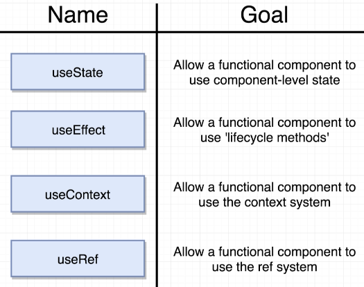
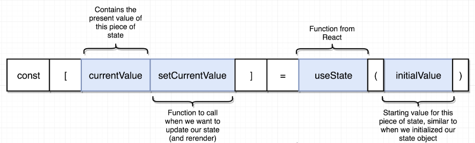
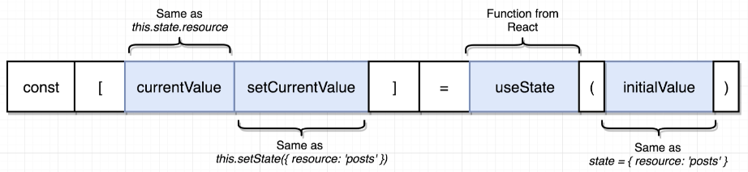
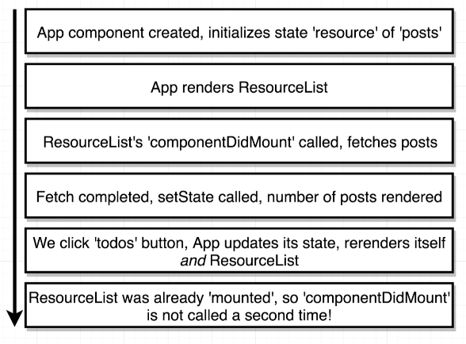
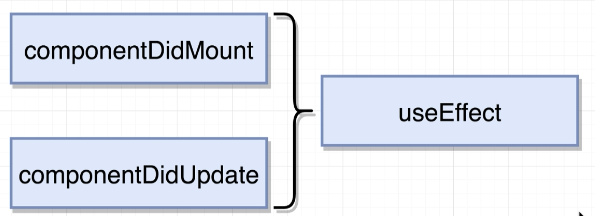
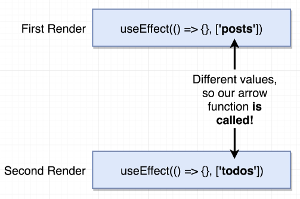
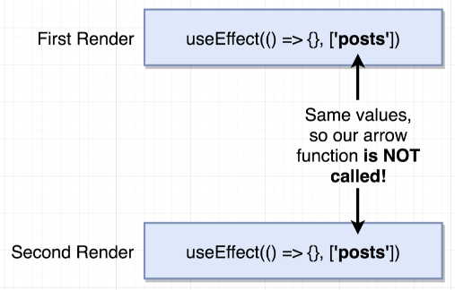

# HOOKS

## Intro


## App Outline


## Functions included with Hooks



- ### `useState`

  ```js
  import React, { useState } from 'react';

  const App = () => {
    const [resource, setResource] = useState('posts');
    const [counter, setCounter] = useState(0);

    return (
      <div>
        <div>
          <button onClick={() => setResource('posts')}>Posts</button>
          <button onClick={() => setResource('todos')}>Todos</button>
        </div>
        {resource}
      </div>
    );
  };

  export default App;
  ```

  
  

- ### `useEffect`

  Problem with using `componentDidMount` and `componentDidUpdate` to load data and rerender

  

  Solution to that is by using `useEffect`

  

  How `useEffect` works

  

  

  ```js
  // Determine if the callback function will be called the second time

  useEffect(() => {}); // when we don't provide a second argument to useEffect, it'll call the callback fn forever, similar to the problem with using `componentDidMount` and `componentDidUpdate`

  useEffect(() => {}, []); // no

  useEffect(() => {}, [{ name: 'Alex' }]); // yes, b/c the obj inside has different memory address, that's what useEffect compares

  useEffect(() => {}, [10, 10]); // no

  useEffect(() => {}, [10, 10]); // first time
  useEffect(() => {}, [10]); // second time => no
  ```
