# Server side rendering with React and Express

## Typical React app vs Server Side Rendering with React App

- ### Typical React App

  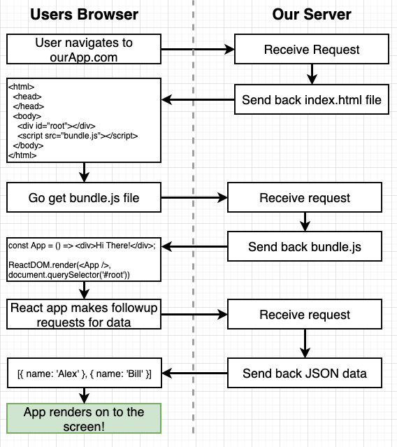

  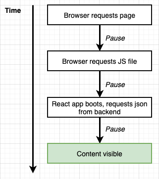

- ### SSR with React

  

  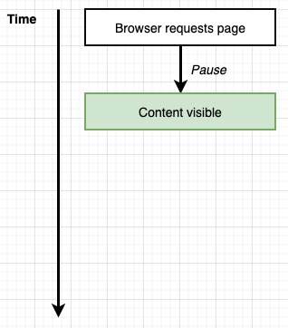

## App Setup

- ### Layout

  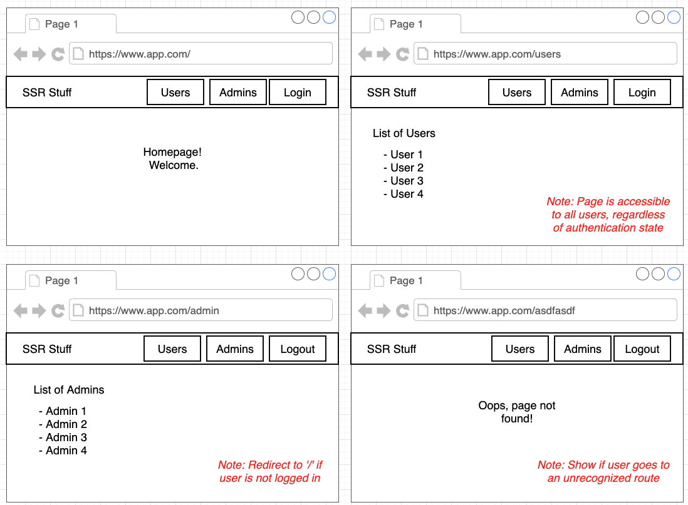

  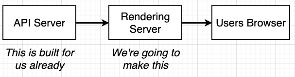

- ### Why separate API server and Rendering server?

  Make it easier to scale and increase performance

  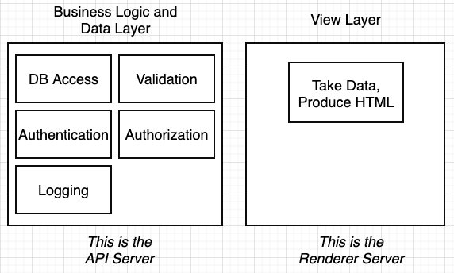

  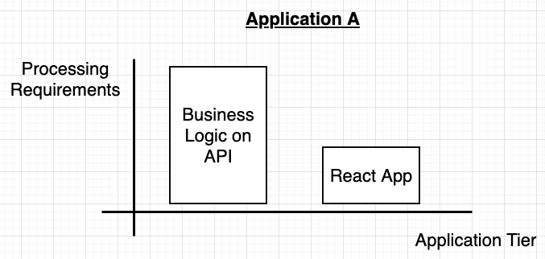

  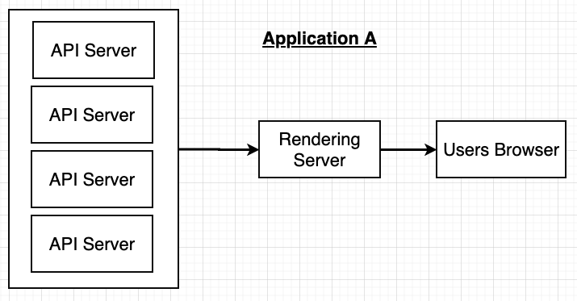

  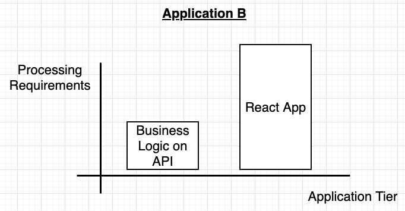

  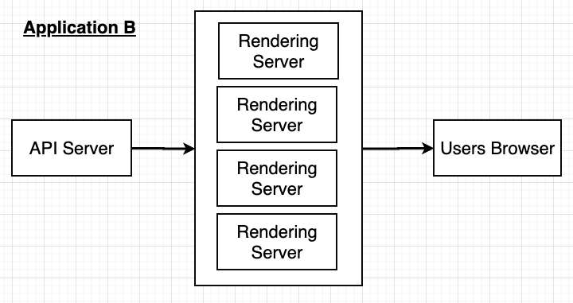

- ### How to make React works with Express

  When using React for frontend, we can do `ReactDOM.render` to create components and render on the DOM. However, when React works in the backend, there's no DOM to be attached to, we can only return a string that includes HTML to the browser. We use `renderToString` from `react-dom` to do that in place of `render`

  

  NodeJS doesn't understand JSX syntax so we have to run `webpack` and `babel` to convert it to the version NodeJS can process and bundle it into 1 file. Then nodeJS will run that one file to start up the server

  To make this works, we have to setup configuration files for webpack and babel. Those files are `webpack.base.js`, `webpack.client.js`, `webpack.server.js`

  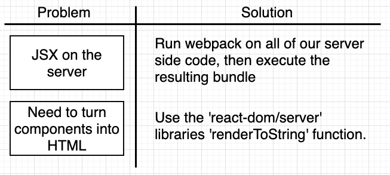

  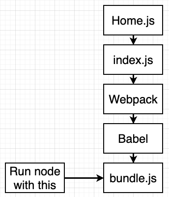

  We also need to bundle all of the JS files from React side to send back to frontend, otherwise, the data sent back is just plain HTML. We bundle a separate file for React frontend, and not use the bundle.js made for the server because we don't want to expose code/data in the server to our clients.

  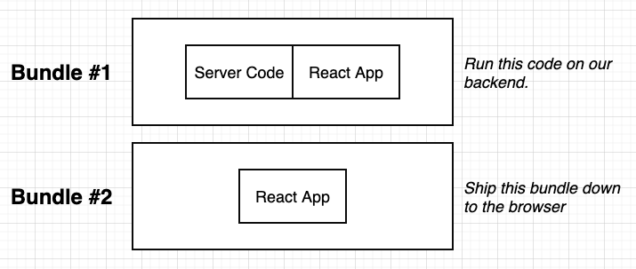

  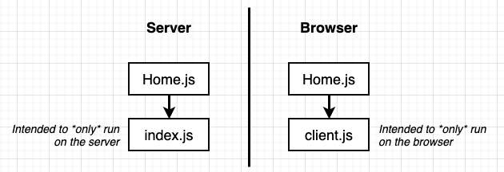

  A brief summary of the browser-server flow after we include a js script to make the browser requests for the bundle.js for frontend

  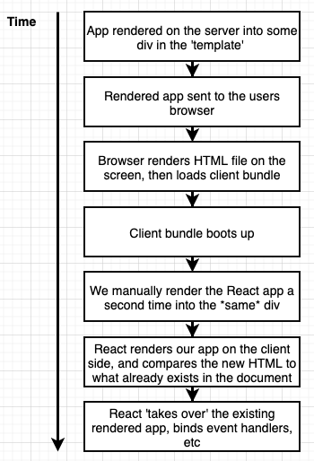

## Setup Routes (Navigation) for Server and Client

- Normal flow of requests made from a browser to React App (without SSR) using BrowserRouter. The server always sends back a single index.html file

  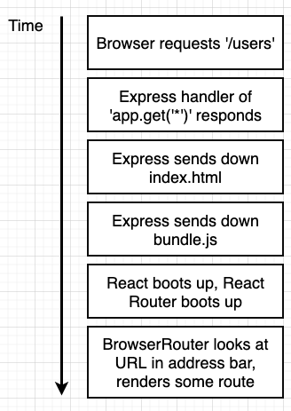

- With the SSR React app, we want Express to pass all requests to React Router and let React Router decides what to send back to the client

  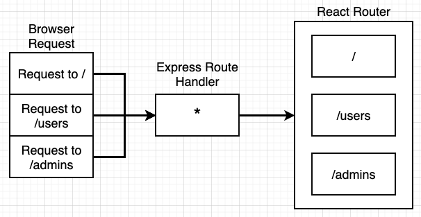

- BrowserRouter works by looking at the address URL and processing the appropriate components to render on the screen. When rendering on the server side, there's no address bar for BrowserRouter to look at so we have to use another component from React Router for the server side `StaticRouter`

  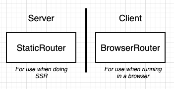

- The app currently already setup for server and client to render its own appropriate JS. We just need to create a single `Routes.js` file that contains all the Route for the app, and pass it in under `StaticRouter` for the server side, and `BrowserRouter` for client side

  ```js
  // in Routes.js
  return (
    <div>
      <Route exact path="/" component={Home} />
    </div>
  );

  // in renderer.js
  renderToString(
    <StaticRouter location={req.path} context={{}}>
      <Routes />
    </StaticRouter>
  );

  // in client.js
  ReactDOM.hydrate(
    <BrowserRouter>
      <Routes />
    </BrowserRouter>,
    document.querySelector("#root")
  );
  ```

  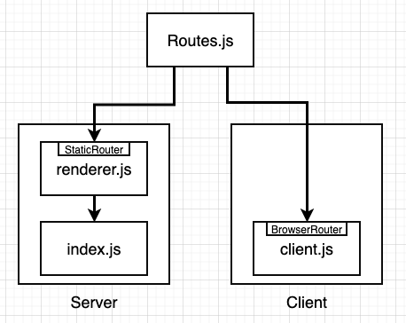

## Integrating Support for Redux in SSR

- ### API Server structure (Already built)

  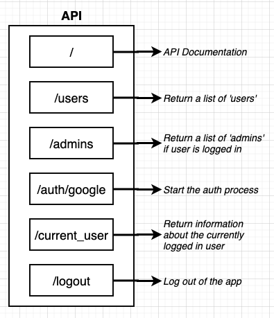

- ### We'd want to integrate Redux for data managing to this app. List of Reducers and Action Creators

  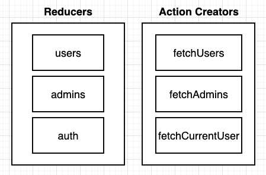

- ### Normal flow of a request in a traditional, client-side only React/Redux app

  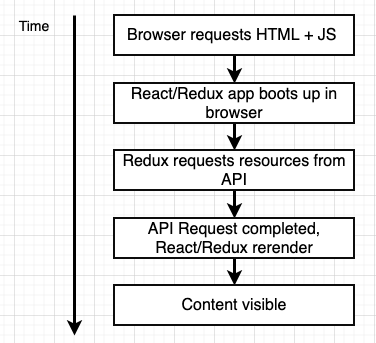

- ### A request flow in a React/Redux app with SSR

  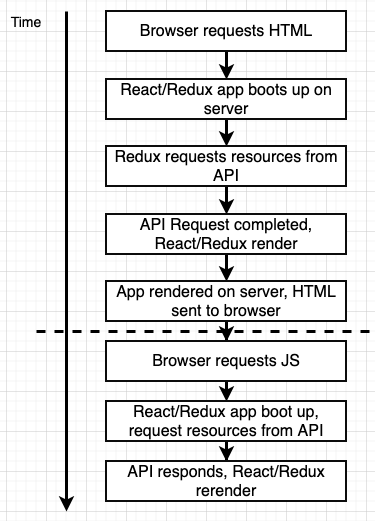

- ### Challenges to integrate Redux to the server
  - **Redux needs different configuration on browser vs server**: The way Redux behaves on the server needs to be significantly different from the way it behaves on the client b/c of the other three challenges listed below. In other words, to solve problems with the below three challenges, Redux needs to behave differently on the server. To setup Redux on the server, we'd take a very similar approach to how we setup Router. There will be two Redux stores, one for the server bundle, and one for the client bundle.
  - **Aspects of authentication needs to be handled on server. Normally this is only on the browser**: The API requires user to logged in in other to access to some routes. This API uses cookie based authentication, so as long as user go through the Oauth authentication process, the browser will be able to authenticate to the API with the use of cookies. The cookie based authentication is very straight forward. However, with SSR, when our app is rendered on the server, we don't easily have access to the cookie data that proves the user is authenticated.
  - **Need some way to detect when all initial data load action creators are completed on server**: In a normal React/Redux app, whenever we need to load up some data, we'd call an action creator that'll make some Ajax requests and when the requests are resolved, we dispatch an Action and the app naturally updates. After the reducers run, Redux collects all the new states, and rerenders the app automatically. The key there is when we call an Action Creator, the updates occur automatically so we don't get any signals when the action creators finish fetching data. But on the server, when we attempt to fetch some data from an action creator, we need to know the exact instant that the request issued by an action creator is finished so that we can attempt to render the app to a string and send it back to the browser (why? b/c we want to show the user some data as fast as possible). That means we need some way to know when an action creators finish loading some initial data.
  - **Need state rehydration on the browser**: Similar to how React needs a kickstart to rehydrate (rerender) after the initial HTML loads up, redux also needs a kickstart to rehydrate its process.
