# Overview

## Building a streaming web app service similar to `twitch` but way simpler


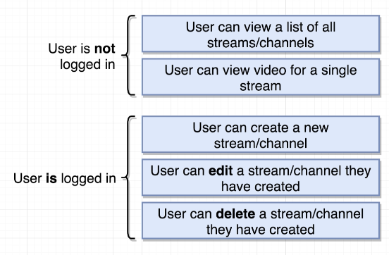

## Some Mockups

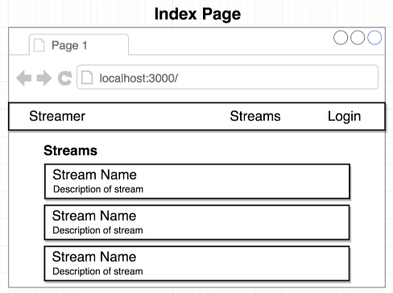

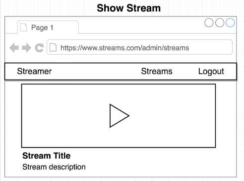

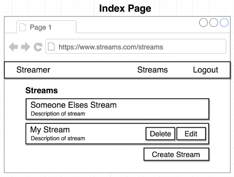

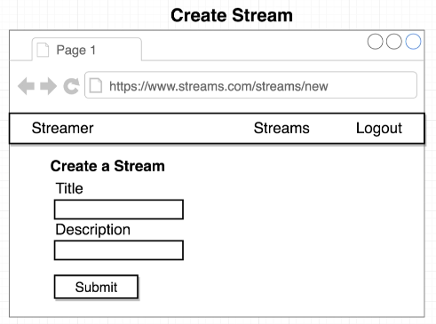

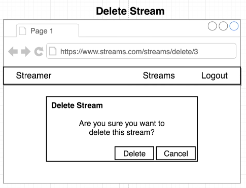

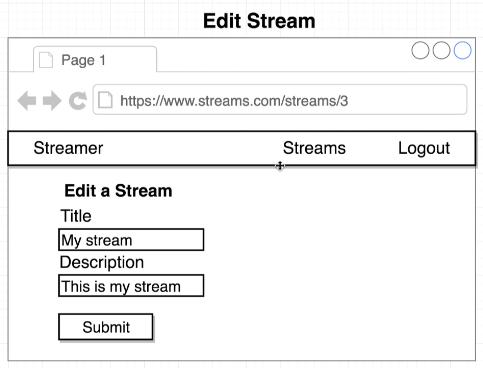

## App Challenges

- Need to be able to navigate around to separate pages in our app -> will use `React Router`
- Need to allow a user to login/logout -> Use Google Oauth to do authentication
- Need to handle forms in Redux
- Need to master CRUD operations in React-Redux
- Errors will likely occur. Need good error handling

## Dependencies

### react-router-dom

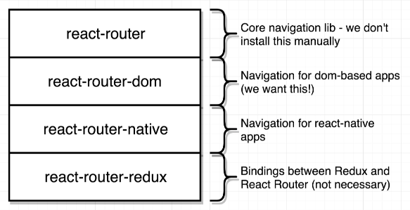

We never want to install `react-router` by itself. `react-router` library published on npm is the core library of everything inside react-router general project: it decides how to work with react, how to change content out depending on different rules...

To get the actual implementation logic of react-router that works inside the browser, we'd install `react-router-dom`. So whenever we want to use `react router` in a project to handle navigation in browsers, we always use `react-router-dom`

# Theory

## How React Router Works

```js
import React from "react";
import { BrowserRouter, Route } from "react-router-dom";

const PageOne = () => {
  return <div>PageOne</div>;
};

const PageTwo = () => {
  return (
    <div>
      PageTwo
      <button>Click Me</button>
    </div>
  );
};

const App = () => {
  return (
    <div>
      <BrowserRouter>
        <div>
          <Route path="/" exact component={PageOne} />
          <Route path="/pagetwo" component={PageTwo} />
        </div>
      </BrowserRouter>
    </div>
  );
};

export default App;
```

  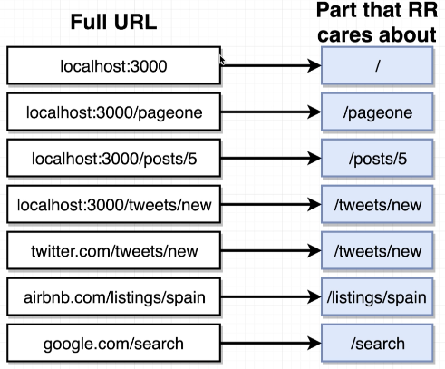
  
  

  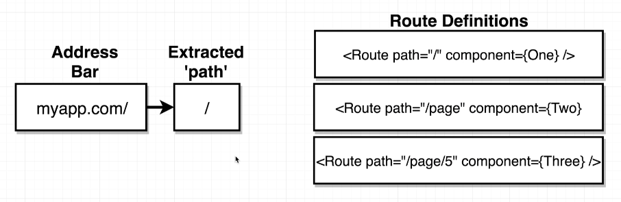

  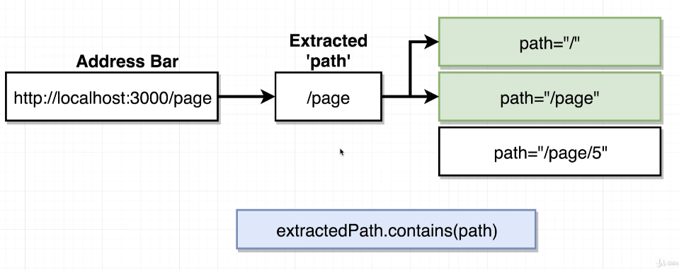

What RR really cares about is the part after the domain, so RR extracts that path out.

By default, RR checks if this path contains the paths define with `Route` to display all the contained paths. In the example, the extracted path is `/page` so it'll display the components in path `/` and `/page`.

To override this behavior, we'd include another props `exact` to `Route` like `<Route path="/" exact component={PageOne} />`. With the keyword `exact`, RR will compare `===` instead of `contains`. If it doesn't match 100%, it won't display anything. This only work for any Routes that includes `exact`

## Navigation with React Router

We usually use anchor tage `<a>` to navigate between different pages such as `<a href="/pagetwo">Navigate to Page Two</a>`. Even though using `<a>` seems to work, we don't want to use it with React Router because when you click on the `<a>` tag, the browser will make the request and replace the current HTML by the new response HTML. It also dump all the data that had been loaded into the react-redux application. The users have to do it all over again to have that data back.

  

To solve this problem, we'll use `Link` Component from `react-router-dom` in place of an anchor tag: `<Link to="/pagetwo">Navigate to Page Two</Link>`. By using `Link`, RR will prevent the browsers from making a request to the server. Instead RR will look at the route and hide/show different components on the same HTML file

  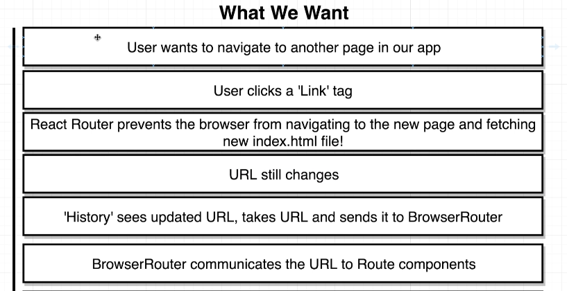
  

## Different Router Types

React Router has 3 different types of routers: `BrowserRouter`, `HashRouter`, `MemoryRouter`

The difference between them is the part of the URL that they decide to look at to show what on the screen.

HashRouter adds a `/#` between the Top Level Domain (TLD) and the `path` in a `Route`

  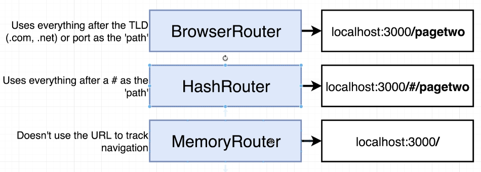

Why do we care? A lot of it comes down to deployment.

### BrowserRouter

- `BrowserRouter` by far the most complicated to deploy inside of any realistic settings. In many cases, doing deployment with BrowerRouter is very easy because many deployment services understand that you'll use something similar to BrowserRouter to deploy your application so these services make deployment with BrowserRouter pretty straight forward. However, in many cases, deployment with BrowserRouter can be very challenging

  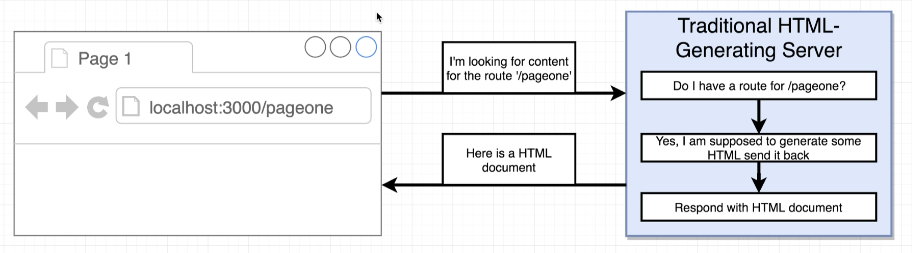

  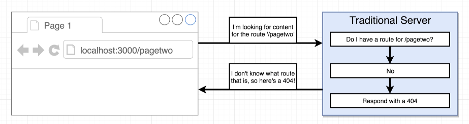

  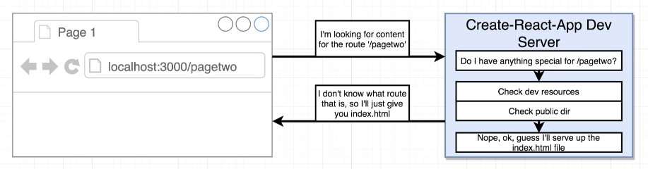

- When we're developing our app with create-react-app, we're running the app with create-react-app Development Server, this server has a flow setup like in the screenshot. When we make a request to the server to get `/pagetwo`, the server automatically returns the index.html file. After the browser loads the html file, it sees there's a link to a JS file `bundle.js` (the file contains all of our application code). The application then loads up => react router loads up => the history, created by BrowserRouter inspect the url, sees that we're at the route `/pagetwo`. The History tells BrowserRouter that we're at PageTwo. The BrowserRouter then tell the `Route` we're at page two so render appropreately

- And the key to make `BrowserRouter` works is the last step: when it doesn't see a matching route, it'll return the index.html file instead of a 404 Page not found like in traditional web server.

- So to make `BrowserRouter` work in production, we need to set up server in the idential fashion, and this is what makes using `BrowserRouter` challenging

### HashRouter

- With HashRouter, you're supposed to tell the server to not take a look at anything after the hash so that it can only return the index.html page.
- Example: when you make a request to `localhost:3000/#/pagetwo`, the server return a response based on the url `localhost:3000` which returns index.html. Then after the application loads up, the frontend app then looks at the path after the `#` to determine what to show on the screen
- A HashRouter is more flexible than BrowserRouter because it doesn't require any special configurations by backend server.
- An good example regards when to use HashRouter: when you deploy to Github Pages. Github Pages doesn't allow you to do any special types of logic to only return index.html page like how create-react-app dev server

# OAuth Authentication

  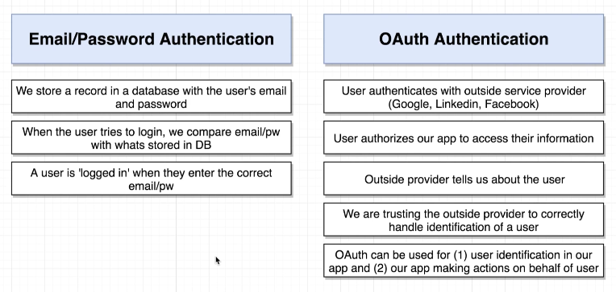

  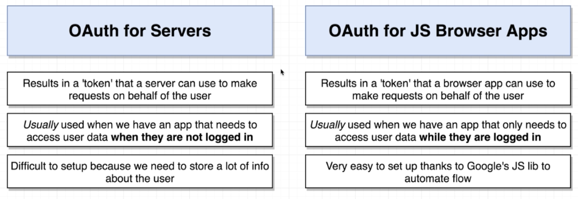

  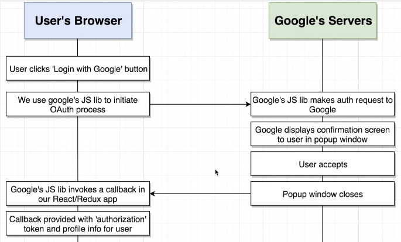

  
