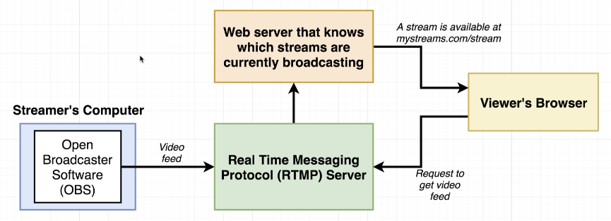
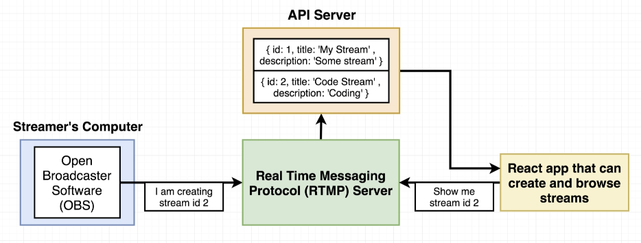
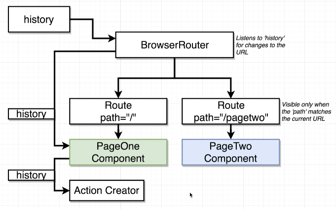
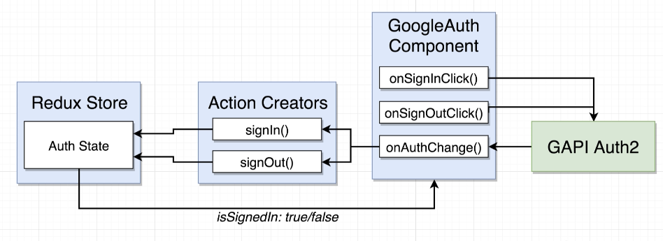
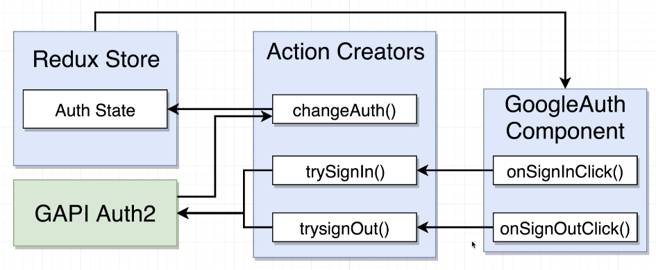
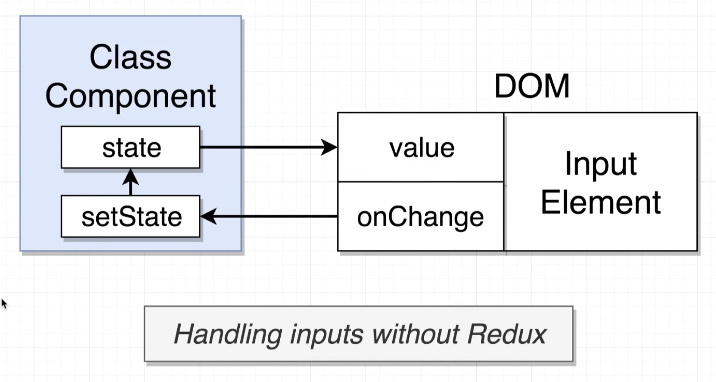
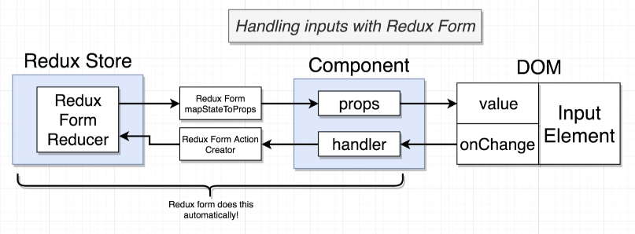
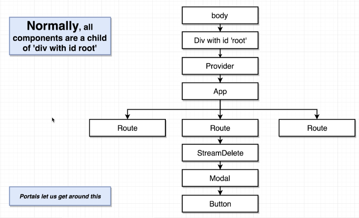
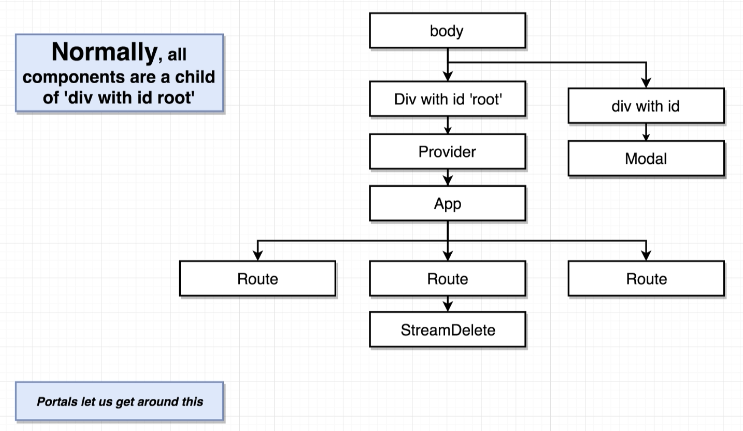

# Overview

## Building a streaming web app service similar to `twitch` but way simpler






## Some Mockups


## App Challenges

- Need to be able to navigate around to separate pages in our app -> will use `React Router`
- Need to allow a user to login/logout -> Use Google Oauth to do authentication
- Need to handle forms in Redux
- Need to master CRUD operations in React-Redux
- Errors will likely occur. Need good error handling

## Dependencies

### react-router-dom


We never want to install `react-router` by itself. `react-router` library published on npm is the core library of everything inside react-router general project: it decides how to work with react, how to change content out depending on different rules...

To get the actual implementation logic of react-router that works inside the browser, we'd install `react-router-dom`. So whenever we want to use `react router` in a project to handle navigation in browsers, we always use `react-router-dom`

# Theory

## How React Router Works

```js
import React from "react";
import { BrowserRouter, Route } from "react-router-dom";

const PageOne = () => {
  return <div>PageOne</div>;
};

const PageTwo = () => {
  return (
    <div>
      PageTwo
      <button>Click Me</button>
    </div>
  );
};

const App = () => {
  return (
    <div>
      <BrowserRouter>
        <div>
          <Route path="/" exact component={PageOne} />
          <Route path="/pagetwo" component={PageTwo} />
        </div>
      </BrowserRouter>
    </div>
  );
};

export default App;
```

  
  
  

  

  

What RR really cares about is the part after the domain, so RR extracts that path out.

By default, RR checks if this path contains the paths define with `Route` to display all the contained paths. In the example, the extracted path is `/page` so it'll display the components in path `/` and `/page`.

To override this behavior, we'd include another props `exact` to `Route` like `<Route path="/" exact component={PageOne} />`. With the keyword `exact`, RR will compare `===` instead of `contains`. If it doesn't match 100%, it won't display anything. This only work for any Routes that includes `exact`

## Navigation with React Router

We usually use anchor tage `<a>` to navigate between different pages such as `<a href="/pagetwo">Navigate to Page Two</a>`. Even though using `<a>` seems to work, we don't want to use it with React Router because when you click on the `<a>` tag, the browser will make the request and replace the current HTML by the new response HTML. It also dump all the data that had been loaded into the react-redux application. The users have to do it all over again to have that data back.

  

To solve this problem, we'll use `Link` Component from `react-router-dom` in place of an anchor tag: `<Link to="/pagetwo">Navigate to Page Two</Link>`. By using `Link`, RR will prevent the browsers from making a request to the server. Instead RR will look at the route and hide/show different components on the same HTML file

  
  

## Different Router Types

React Router has 3 different types of routers: `BrowserRouter`, `HashRouter`, `MemoryRouter`

The difference between them is the part of the URL that they decide to look at to show what on the screen.

HashRouter adds a `/#` between the Top Level Domain (TLD) and the `path` in a `Route`

  

Why do we care? A lot of it comes down to deployment.

### BrowserRouter

- `BrowserRouter` by far the most complicated to deploy inside of any realistic settings. In many cases, doing deployment with BrowerRouter is very easy because many deployment services understand that you'll use something similar to BrowserRouter to deploy your application so these services make deployment with BrowserRouter pretty straight forward. However, in many cases, deployment with BrowserRouter can be very challenging

  

  

  

- When we're developing our app with create-react-app, we're running the app with create-react-app Development Server, this server has a flow setup like in the screenshot. When we make a request to the server to get `/pagetwo`, the server automatically returns the index.html file. After the browser loads the html file, it sees there's a link to a JS file `bundle.js` (the file contains all of our application code). The application then loads up => react router loads up => the history, created by BrowserRouter inspect the url, sees that we're at the route `/pagetwo`. The History tells BrowserRouter that we're at PageTwo. The BrowserRouter then tell the `Route` we're at page two so render appropreately

- And the key to make `BrowserRouter` works is the last step: when it doesn't see a matching route, it'll return the index.html file instead of a 404 Page not found like in traditional web server.

- So to make `BrowserRouter` work in production, we need to set up server in the idential fashion, and this is what makes using `BrowserRouter` challenging

### HashRouter

- With HashRouter, you're supposed to tell the server to not take a look at anything after the hash so that it can only return the index.html page.
- Example: when you make a request to `localhost:3000/#/pagetwo`, the server return a response based on the url `localhost:3000` which returns index.html. Then after the application loads up, the frontend app then looks at the path after the `#` to determine what to show on the screen
- A HashRouter is more flexible than BrowserRouter because it doesn't require any special configurations by backend server.
- An good example regards when to use HashRouter: when you deploy to Github Pages. Github Pages doesn't allow you to do any special types of logic to only return index.html page like how create-react-app dev server

### Plain Router with Different History Type

- Essentially, both `BrowserRouter` and `HashRouter` behave the way they do is because of the History type that they have.
- BrowserRouter creates and manages History called BrowserHistory. The BrowserHistory decides to only look at the part of a url after the main domain. Only Component render inside of BrowserRouter will be passed down this History Object.
- The History is not only watching the address bar, it can also change the address bar. So if a component has access to this history object, it can easily trigger navigation like redirect to another route.
- For components rendered outside of BrowserRouter to trigger navigation, we could potentially pass the history object to Action Creator. However it's a pain.

  

- A simpler solution for programmatic Navigation is to use a plain Router with a BrowserHistory that we manage. That way, we'd have access to the history obj to trigger any navigation we want

```js
// history.js
import { createBrowserHistory } from "history";
export default createBrowserHistory();

// part of App.js
import { Router, Route } from "react-router-dom";
import history from "../history";

<Router history={history}>
  <div>
    <Header />
    <Route path="/" exact component={StreamList} />
    <Route path="/streams/new" exact component={StreamCreate} />
    <Route path="/streams/show/:id" exact component={StreamShow} />
  </div>
</Router>;

// part of actions index.js
import history from "../history";

export const editStream = (id, formValues) => async (dispatch) => {
  const response = await streams.patch(`/streams/${id}`, formValues);
  dispatch({ type: EDIT_STREAM, payload: response.data });
  history.push("/"); // Programmatic navigation to get user back to the root route
};
```

# OAuth Authentication

  

  

  

  

To use the Google API library, we have to include this script in the `<head>` of `index.html`

```html
<script src="https://apis.google.com/js/api.js"></script>
```

## OAuth with Redux

There are 2 possible ways to integrate Google Authentication with Redux

### Option 1:



We'd leave the current GoogleAuth Component untouch. This way is not closely followed the convention of Redux so if we'd want to 100% follow the Redux convention, this is not the best approach. However, we'll take this approach because at the end of this project, we'd end up with a single Component that shows the entire process with Google Authentication from start to finish

### Option 2:



This'd be the prefered approach

# Handling Forms with Redux Form

## Intro





## Redux Dev Tools

Redux Form is complex because we don't know what's going on in the store so by using redux dev tools extension (for Chrome and Firefox), we'd have access to Redux store at different point in time.

We need to install the extension to our browser, then insert some code in the root `index.js` to hook our app with this extension

```js
import { createStore, applyMiddleware, compose } from "redux";

const composeEnhancers = window.__REDUX_DEVTOOLS_EXTENSION_COMPOSE__ || compose;
const store = createStore(reducers, composeEnhancers(applyMiddleware()));
```

We can also debug our react redux app with this extension by inserting a query string to the url:

```html
http://localhost:3000/?debug_session=loggedIn
```

`loggedIn` is the name of the debug session, we can have different debug session by entering different names. The redux dev tools will persist all the data in the store that we've been working on.'

When we're done debugging, we shoud remove the query string to avoid the app throws errors because of the persisted data stored in the debug session.

`Airbnb` also use the same extension and have their redux store public so we can have a look at their store to have an idea how to manage complex redux store.

## Redux Form

To use Redux Form, we need to install npm package `redux-form`. It has great documentation: [example](https://redux-form.com/8.3.0/examples/wizard/)

Check the file `StreamCreate.js` in this [commit](https://github.com/ngannguyen117/React-Bootcamp/blob/2e8c79a2d03063945ad0a17130245272071a6b68/8-streams/client/src/components/streams/StreamCreate.js) to see how we apply Redux Form

# React Portals

## Why not using Modals?

- A Modal is a popup on the screen that gray out the background so we can only focus on the modal's content. This means the modal has to be on top of other elements with higher z-index.

- It's a challenge to use Modal with React because if we render a Modal as a child of some components, we don't even know how many elements are on top of it to be able to change z-index. If we manage to change css, it might even break the whole app

  

## Solution: Portals

- To make it work in React, we'd use Portal. Instead of making the Modal a direct child of some components, we make it a direct child of the `body`. That way we don't have to worry about its z-index, it'll always be on top of other element.

- You'd want to use Portals when you want render React Component into some HTML that was not created by your React application for example: you try to introduce react into a server side application like a java app that render HTML in the backend, maybe Ruby on Rails or Django, etc.

  

  ```html
  <!-- in index.html: add a div with id modal right after root -->
  <div id="root"></div>
  <div id="modal"></div>
  ```

  ```jsx
  // in Modal.js
  import React from "react";
  import ReactDOM from "react-dom";

  const Modal = (props) => {
    return ReactDOM.createPortal(
      <div
        onClick={props.onDismiss}
        className="ui dimmer modals visible active"
      >
        <div
          onClick={(e) => e.stopPropagation()}
          className="ui standard modal visiable active"
        >
          <div className="header">{props.title}</div>
          <div className="content">{props.content}</div>
          <div className="actions">{props.actions}</div>
        </div>
      </div>,
      document.querySelector("#modal")
    );
  };

  export default Modal;
  ```
