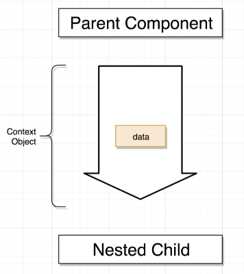
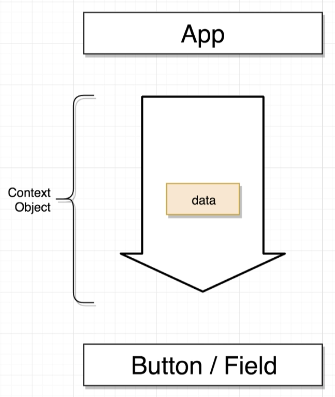
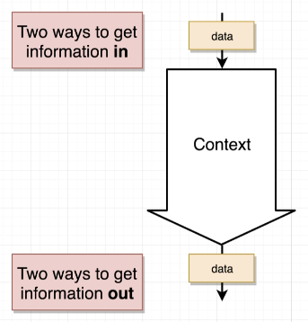
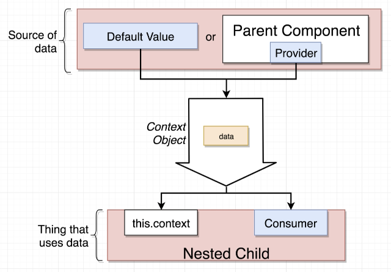
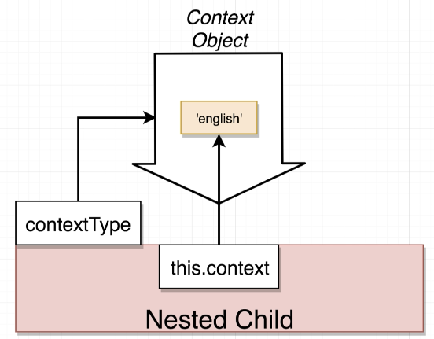
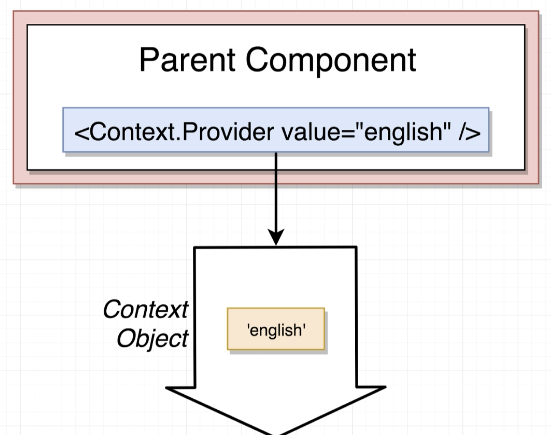
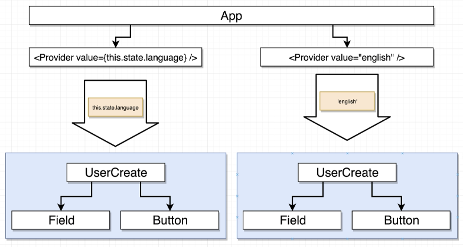
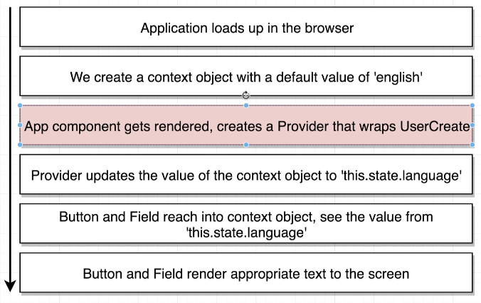
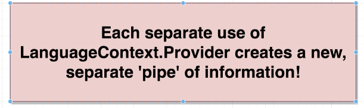

# The Context System with React

## Intro


.


## App Outline


## App applies props vs context


# Context

We can create a context object by

```js
// LanguageContext.js
import React from 'react';
export default React.createContext('english');
```









## Gotcha in Context









## Get information IN the context pipeline

- ### Default Value

  We can set default value of a context obj by providing a parameter when first create the obj

  > React.createContext('english')

- ### Use Provider

  We can provide a value in the Provider to change the data in context obj

  ```js
  // in App.js
  import LanguageContext from '../contexts/LanguageContext';

  <LanguageContext.Provider value={this.state.language}>
    <UserCreate />
  </LanguageContext.Provider>;
  ```

## Accessing Data in the Context Pipeline

- ### this.context

  We first need to set the class property `contextType` to the Context Obj we need

  Then we can access context value by `this.context`

  ```js
  // in Field.js
  import LanguageContext from '../contexts/LanguageContext';

  class Field extends React.Component {
    static contextType = LanguageContext;

    render() {
      const text = this.context === 'english' ? 'Name' : 'Naam';
      return <label>{text}</label>;
    }
  }
  ```

- ### Consumer

  By using Consumer, a component can access to multiple Context objects.

  When using Consumer, we don't set `contextType` anymore b/c that links a class to only 1 Context. We also no longer can access the context value by `this.context` because the idea is we'd have multiple context values, if we do `this.context`, we wouldn't know which context we're refering to.

  ```js
  // in App.js
  <ColorContext.Provider value="red">
    <LanguageContext.Provider value={this.state.language}>
      <UserCreate />
    </LanguageContext.Provider>
  </ColorContext.Provider>;

  // in Button.js
  import LanguageContext from '../contexts/LanguageContext';
  import ColorContext from '../contexts/ColorContext';

  class Button extends React.Component {
    render() {
      return (
        <ColorContext.Consumer>
          {color => (
            <button className={`ui button ${color}`}>
              <LanguageContext.Consumer>
                {value => (value === 'english' ? 'Submit' : 'Voorleggen')}
              </LanguageContext.Consumer>
            </button>
          )}
        </ColorContext.Consumer>
      );
    }
  }
  ```
